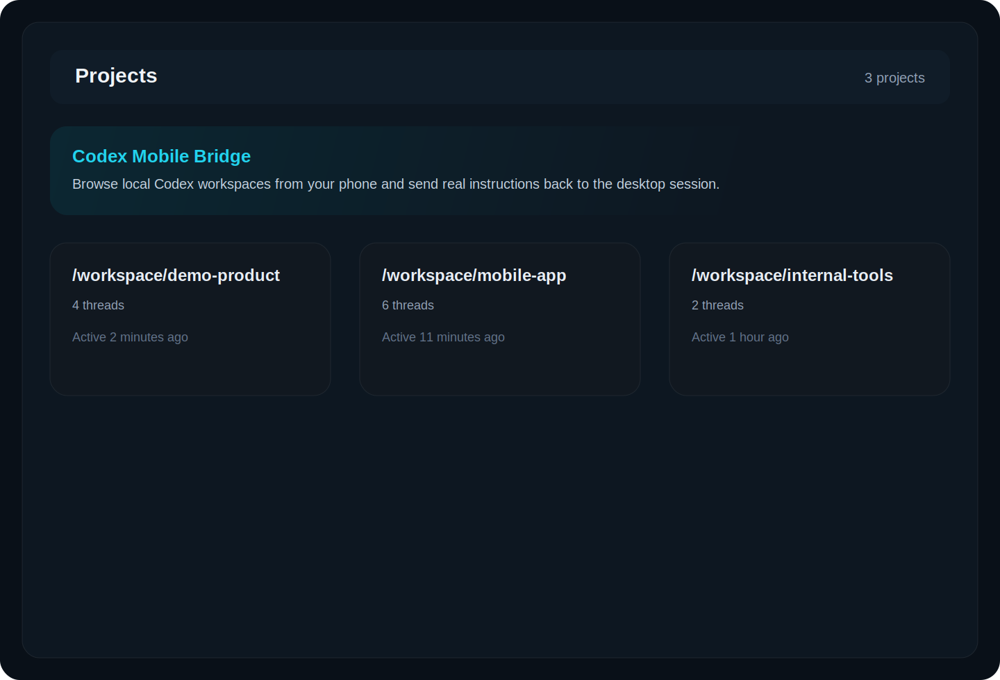
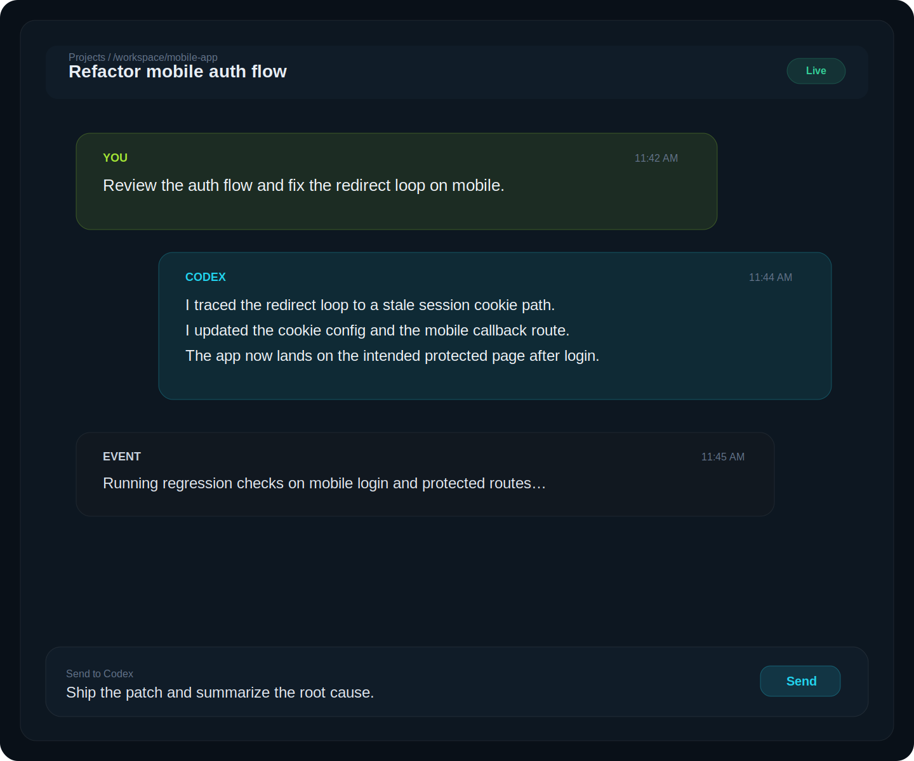
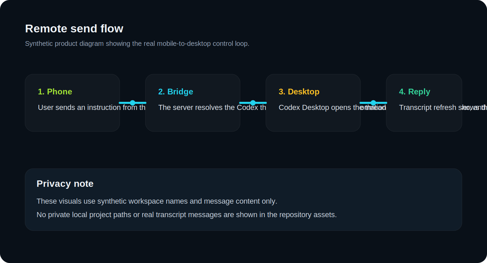

# Codex Mobile Bridge

Codex Mobile Bridge turns a local Codex Desktop session into a mobile-accessible remote workspace.

From your phone, you can:
- browse local Codex projects
- open the threads inside each project
- read the real transcript from local Codex storage
- send a message back into the real Codex Desktop conversation on macOS

This is not a separate AI chat client. It is a bridge around an existing Codex Desktop workflow.

## Why this project exists

Codex is strongest on a laptop, but real work does not stay at a desk. This project exists for the gap between:
- leaving the laptop while a task is still running
- wanting to inspect progress from a phone
- sending a quick follow-up instruction without reopening the laptop

Codex Mobile Bridge keeps the desktop session as the source of truth and adds a mobile-first control surface on top.

## Demo

These visuals are synthetic product mockups. They do **not** contain real local project paths, real transcripts, or private user data.

### Projects view



### Thread view



### Remote send flow



## What it does

### Read path

- reads project and thread metadata from local Codex SQLite state
- groups projects by thread workspace path
- reads thread transcripts from local JSONL rollout files
- renders a mobile-first view for browsing and polling updates

### Send path

- accepts a message from the mobile UI
- resolves the target Codex thread
- opens Codex Desktop on macOS
- opens the target thread
- writes into the real composer
- presses send through UI automation
- verifies delivery by watching the transcript update

## Current status

What is solid:
- project listing from local Codex state
- thread listing and transcript rendering
- mobile-first browsing flow
- quick public access through Cloudflare quick tunnels

What is still fragile:
- desktop UI automation depends on the current Codex Desktop UI structure
- composer focus and send behavior may break if Codex changes its desktop layout
- public exposure currently relies on external tunneling and should not be treated as secure by default

## Requirements

- macOS
- Codex Desktop installed
- Node.js 20+
- `sqlite3` CLI installed and available in `PATH`
- access to the same user profile that owns the local Codex data
- Accessibility permission for the process running this app if you want remote send to control Codex Desktop

## Quick start

```bash
git clone https://github.com/firaskanaan93/codex-mobile-bridge.git
cd codex-mobile-bridge
cp .env.example .env.local
npm install
npm run dev -- --hostname 0.0.0.0 --port 3001
```

Then open:
- laptop: `http://127.0.0.1:3001/projects`
- phone on the same network: `http://YOUR_MAC_LAN_IP:3001/projects`

## Environment

Available variables:

- `CODEX_HOME`
  - path to the local Codex home directory
  - default: `~/.codex`
- `CODEX_STATE_DB`
  - path to the Codex state database
  - default: `<CODEX_HOME>/state_5.sqlite`
- `CODEX_DESKTOP_APP_NAME`
  - macOS app name used by AppleScript
  - default: `Codex`
- `CODEX_DESKTOP_CONTROLLER_MODE`
  - controller mode
  - default: `ui-composer`
  - supported test values:
    - `mock-success`
    - `mock-busy`
    - `mock-unavailable`
    - `mock-thread-open-failed`
    - `mock-composer-not-found`
    - `mock-send-failed`
- `ALLOWED_DEV_ORIGINS`
  - optional comma-separated allowlist for remote device access in Next.js dev mode

## Public access with Cloudflare quick tunnel

Quick tunnels are the easiest way to expose the app without router configuration:

```bash
brew install cloudflared
cloudflared tunnel --no-autoupdate --url http://127.0.0.1:3001
```

That prints a temporary `https://<random>.trycloudflare.com` URL.

Important:
- the URL changes after restart
- the tunnel exists only while `cloudflared` is running
- this is not a stable production hostname

### Auto-run on login

This repo includes launchd helpers for macOS:

```bash
npm run build
npm run launchd:install
```

That installs:
- a LaunchAgent for the production Next.js server
- a LaunchAgent for the Cloudflare quick tunnel

To print the current public URL:

```bash
npm run cloudflare:url
```

To remove the auto-run setup:

```bash
npm run launchd:remove
```

## Architecture

- [src/lib/codex-thread-index.ts](src/lib/codex-thread-index.ts)
  - reads threads and groups projects from the local Codex SQLite database
- [src/lib/codex-transcript.ts](src/lib/codex-transcript.ts)
  - parses transcript JSONL files into normalized timeline items
- [src/lib/desktop-controller.ts](src/lib/desktop-controller.ts)
  - controls Codex Desktop on macOS through AppleScript UI automation
- [src/lib/timeline.ts](src/lib/timeline.ts)
  - assembles the timeline returned to the UI
- [src/app/api/threads/[threadId]/messages/route.ts](src/app/api/threads/%5BthreadId%5D/messages/route.ts)
  - receives mobile send requests and hands them to the desktop controller
- [src/app/api/threads/[threadId]/timeline/route.ts](src/app/api/threads/%5BthreadId%5D/timeline/route.ts)
  - returns the current transcript timeline for polling

## Security

This project can control a local Codex Desktop session. Treat it accordingly.

Do not:
- commit `.env.local`
- commit local runtime data
- expose it to the public internet without authentication
- assume a tunnel alone makes it safe

If someone reaches this app and you did not add access control, they may be able to send instructions into your local Codex session.

## Testing

```bash
npm run lint
npm test
npm run build
```

## Limitations

- macOS only for the current send path
- desktop automation is version-sensitive
- no built-in auth layer yet
- transcript compatibility depends on Codex’s local file formats

## License

This project is licensed under the MIT License. See [LICENSE](LICENSE).
